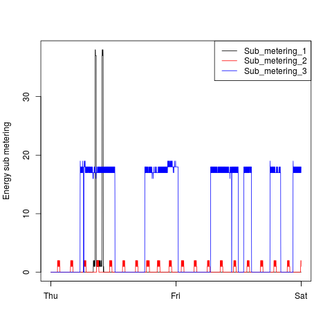
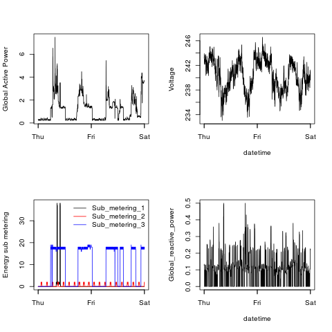

## Overview

This assignment uses the "Individual household electric power consumption Data Set" data from
the <a href="http://archive.ics.uci.edu/ml/">UC Irvine Machine
Learning Repository</a>, available from the Coursera course site at:

* <b>Dataset</b>: <a href="https://d396qusza40orc.cloudfront.net/exdata%2Fdata%2Fhousehold_power_consumption.zip">Electric power consumption</a> [20Mb]

* <b>Description</b>: Measurements of electric power consumption in
one household with a one-minute sampling rate over a period of almost
4 years. Different electrical quantities and some sub-metering values
are available.

<ol>
<li><b>Date</b>: Date in format dd/mm/yyyy </li>
<li><b>Time</b>: time in format hh:mm:ss </li>
<li><b>Global_active_power</b>: household global minute-averaged active power (in kilowatt) </li>
<li><b>Global_reactive_power</b>: household global minute-averaged reactive power (in kilowatt) </li>
<li><b>Voltage</b>: minute-averaged voltage (in volt) </li>
<li><b>Global_intensity</b>: household global minute-averaged current intensity (in ampere) </li>
<li><b>Sub_metering_1</b>: energy sub-metering No. 1 (in watt-hour of active energy). It corresponds to the kitchen, containing mainly a dishwasher, an oven and a microwave (hot plates are not electric but gas powered). </li>
<li><b>Sub_metering_2</b>: energy sub-metering No. 2 (in watt-hour of active energy). It corresponds to the laundry room, containing a washing-machine, a tumble-drier, a refrigerator and a light. </li>
<li><b>Sub_metering_3</b>: energy sub-metering No. 3 (in watt-hour of active energy). It corresponds to an electric water-heater and an air-conditioner.</li>
</ol>

## Assignment contents

This repository contains, in addition to the original assignment
instructions and reference figures, four R scripts and 4 PNG files.

* The R script ''Plot1.R'' produces the figure ''Plot1.png'' when
it is run. The other three R scripts follow this naming scheme.

* For the assignment each R script stands alone, however the read function 
is identical for each of the last 3 scripts. My preference would be to have 
one R script with a single read function and individual functions for
plots 1 through 4.

* The labelling follows the reference figures exactly, and these would be different
if I were plotting these data for myself rather than matching the reference figures.

* To match the reference files all generated PNG files have a transparent background.

## The Plots

### Plot 1

 

### Plot 2

 

### Plot 3

 

### Plot 4

 

